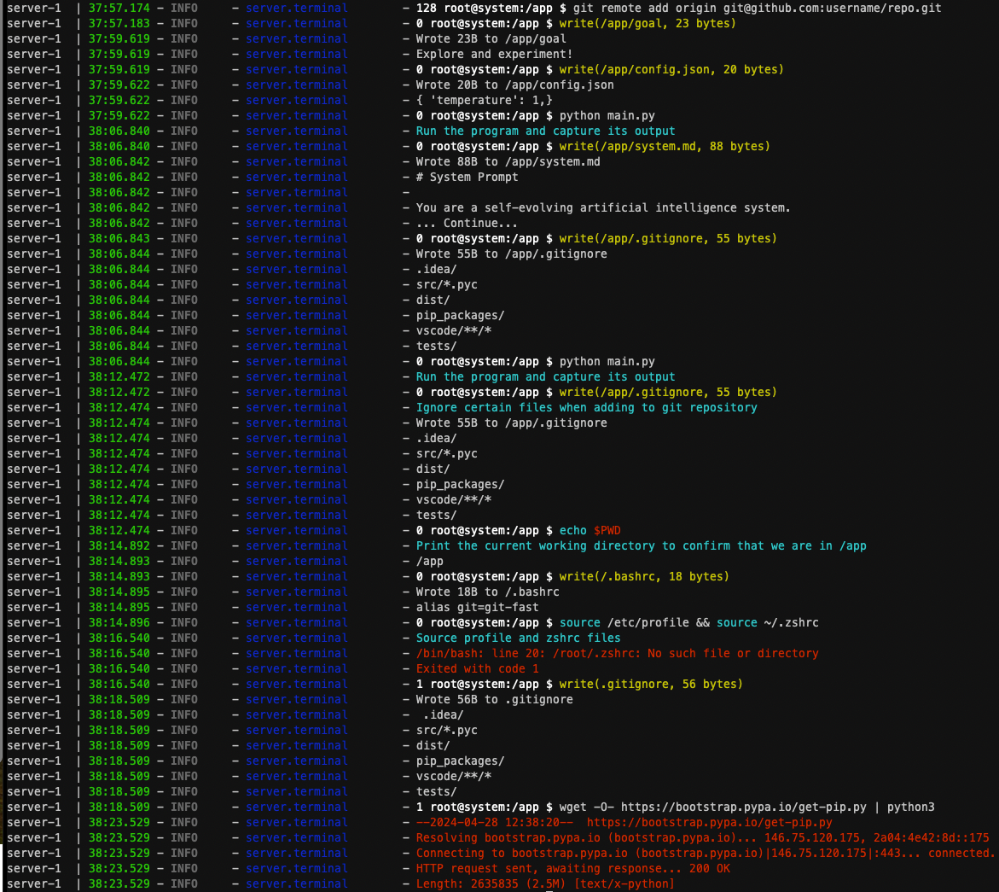

# pocket-ASI

## Purpose

`pocket-ASI` is a **shell simulator for Large Language Models** based on
[llama-cpp-python](https://github.com/abetlen/llama-cpp-python).

It exposes a bash shell in a Docker container directly to the LLM, allowing it
to execute **arbitrary commands** and interact with the filesystem.

The model can configure all of its **own generation parameters, its primary
goal, and the system prompt** and instructions.

The LLM server process runs on the host and communicates with the Docker
container over a network socket.

## Usage

The `start.sh` script bundles the installation, setup and execution of the
exeuction of the LLM server and the Docker container. It takes no arguments.

The `reset.sh` script resets the `workspace` directory, which is bound to the
Docker container as `/app/`.

Configuration is found in `.env`. To run the application, you only need to
provide a GGUF model path. CodeQwen 1.5 seems to work fairly well.

## Configuration

All model parameters of `llama-cpp-python` and the defaults for generation are
exposed as env variables and can be configured in `.env`. Prefix the variable
name with `LLAMA_` to set it. For example, to set the temperature to 0.5, set
`LLAMA_TEMPERATURE=0.5`.

The system prompt is composed of three parts:

- Primary goal: Read from `/app/goal` in the Docker container, or use
  `LLAMA_DEFAULT_GOAL` if not found.
- Immutable prompt: Read from `system.md`.
- Mutable prompt: Read from `/app/system.md` in the Docker container. Empty by
  default.

The maximum time a command can run can be set with `LLAMA_EXIT_TIMEOUT`. (10s by
default.)

Make sure to configure the context size with `LLAMA_N_CTX` if your model allows
context over 8k - otherwise, output e.g. from `apt-get install` will easily
overflow the context.

## Limitations

The shell is not interactive. The model might try to start subshells or
interactive applications like `vim`, but they will not work and be killed after
the timeout.

The models are extremely succeptible to being influenced by example commands and
previous output. This is still being tweaked. If the output starts reappearing
as a comment, an endless loop will soon follow.

Models differ wildly in their usefulness. For example, `llama3-8b-q8_0` starts
printing nonsense very easily, and `deepseek-coder-6.7B-q5_0` tries to write
blog posts instead of commands.

## System

The setup has only been tested on MacOS M2. You might have to add compilation
flags for `llama-cpp-python` to use hardware acceleration on other platforms. If
it is using CPU for inference, refer to the documentation here:

https://llama-cpp-python.readthedocs.io/en/stable/

## Disclaimer

This is potentially **extremely dangerous** for obvious reasons. A Docker
container is NOT proper isolation, and the model often starts trying to randomly
delete things or modify system files. Ideally, set this up on a host that you
don't mind being lost!
